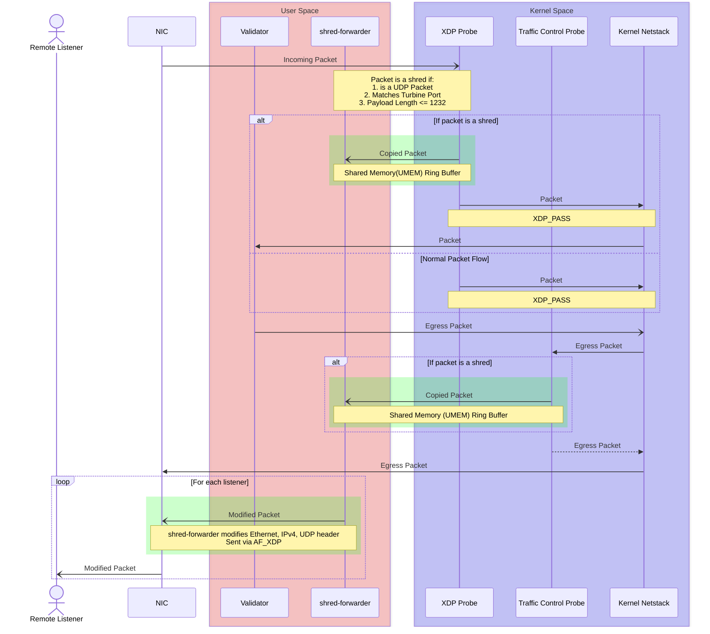

# Shredcaster

"Shredcaster is a lightweight utility that lets any Solana full node (validator, RPC, or Mithril verifying node) forward Turbine (TVU) packets to arbitrary UDP listeners. Compared to existing open-source solutions, it offers several key improvements, including:

## Proposed Architecture




## Compilation

[bpf-linker](https://github.com/aya-rs/bpf-linker) is required to compile the BPF probe which monitors TVU traffic.

```bash
cargo build --release -p shred-forwarder
```

## Running

Elevated privileges are required to run `shred-forwarder`

To view the help menu:
```bash
sudo ./target/release/shred-forwarder --help
```


Example:

```
sudo ./target/release/shred-forwarder --tvu-ports 9000 --iface eth0 --listeners 127.0.0.1:5000
```

This will monitor incoming turbine packets on UDP port 9000 and interface `eth0`, and forward this traffic to a UDP socket running on `127.0.0.1:5000`

Multiple listeners are supported
```
--listeners 127.0.0.1:5000 --listeners 127.0.0.1:5001
```

Listener can also be a remote address.

Multiple TVU ports are also supported


## Monitoring

Watching TVU broadcast is currently work in progress. It can be enabled with the `--watch-egress` flag
