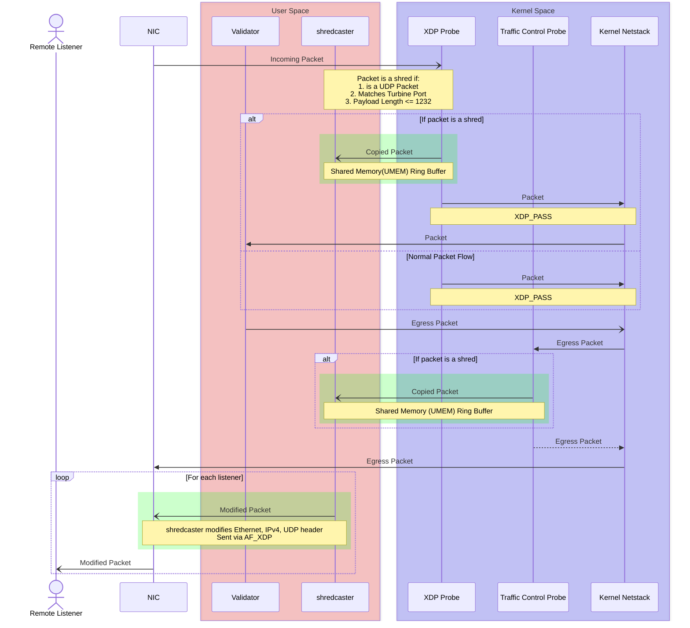

# Shredcaster

Shredcaster is a lightweight standalone utility that allows any Solana full node, including a validator, RPC node, or Mithril verifying node, to forward Turbine (TVU) shred packets to external UDP listeners.

Key benefits:

1) Standalone design – Requires little or no modification to the Solana client codebase.
Note: If XDP-based broadcast is enabled, a small change is required to forward leader-produced shreds.

2) No node disruption – Works without restarting or reconfiguring the node.

3) Minimal performance overhead – Uses eXpress Data Path (XDP) for efficient zero-copy packet forwarding.

4) Multi-recipient forwarding – Supports sending shreds to multiple UDP listeners simultaneously.

## Architecture




## Running Shredcaster

### Building

[bpf-linker](https://github.com/aya-rs/bpf-linker) is required to compile the BPF probe which monitors TVU traffic.

```bash
cargo build --release -p shredcaster
```

### Running

Elevated privileges are required to run `shredcaster`

To view the help menu:
```bash
sudo ./target/release/shredcaster --help
```


Example:

```
sudo ./target/release/shredcaster --tvu-ports 9000 --iface eth0 --listeners 127.0.0.1:5000
```

This monitors incoming Turbine shreds on UDP port 9000 and interface `eth0`, forwarding this traffic to a UDP socket running on `127.0.0.1:5000`

```
--listeners 127.0.0.1:5000 --listeners 127.0.0.1:5001
```

Listeners can be local or remote addresses, and multiple TVU ports are supported.


### Monitoring

Watching TVU broadcast is currently a work in progress. It can be enabled with the `--watch-egress` flag
